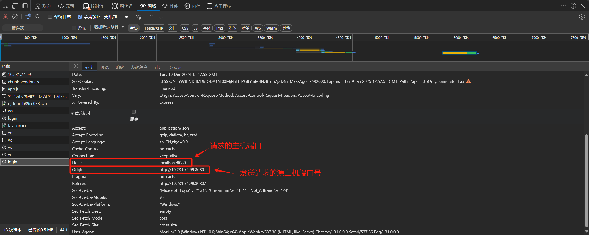
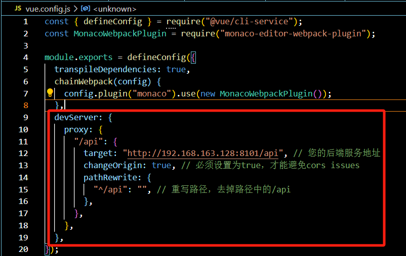

# 1.为什么会出现跨域的问题
- 由于在本次大作业中，我们采取的是前后端分离的架构
- 在前后端分离架构中，前端需要调用后端提供的API接口来获取数据
- 但是由于**浏览器的同源策略**，并且我们的前后端服务分布在两台不同的计算机上（不同的端口上），就会产生跨域的问题
- 同源策略是浏览器为了保护用户信息安全而设计的一种安全机制。它限制了一个页面中加载的资源只能来自于同一个域名、协议和端口号。如果两个页面的协议、域名或端口有任何一个不同，就被视为不同源，那么它们之间的通信就会受到限制。这种限制主要是为了防止恶意网站窃取用户数据，保证用户隐私和安全，以及实现信息隔离，防止不同域名下的资源相互影响

# 2.非跨域请求和跨域请求
- **非跨域**的请求在请求头中只会包含**请求**的主机名
- 但是**跨域**的请求还需要包含当前**发送请求**的源主机的主机名
- 

# 3.解决跨域问题
- 本次大作业解决的方法是通过前端配置代理
- 通过请求本地的服务器，然后本地的服务器再去请求远程的服务器，最后本地服务器再将请求回来的数据返回给浏览器
- 我在vue.config.js中添加了以下配置
    - 
    - 这段代码的目的是将所有以 /api 开头的前端请求代理到后端服务器 http://192.168.163.128:8101/api，并移除路径中的 /api 前缀。通过设置 changeOrigin 为 true，可以避免因代理引起的CORS问题。

# 4.备选方案——Nginx反向代理
要想使用这一方案，就得了解反向代理的工作原理
- 请求接收：
    - 客户端向Nginx服务器发送请求，Nginx作为前端服务器，对外提供服务
- 请求转发：
    - Nginx根据配置的规则，将接收到的请求转发到一个或多个后端服务器。这个过程对客户端是透明的，客户端只知道Nginx的地址
- 响应处理：
    - 后端服务器处理请求并返回响应给Nginx。Nginx再将响应转发回客户端

具体实现：
- 在Nginx的配置文件中，增加一个server块，如下所示：
```
server {
    listen 80;  # 监听端口
    server_name example.com;  # 您的域名

    location /api/ {
        proxy_pass http://192.168.163.128:8101/api/;  # 后端服务地址
        proxy_set_header Host $host;  # 设置请求头
        proxy_set_header X-Real-IP $remote_addr;  # 设置请求头，传递客户端真实IP
        proxy_set_header X-Forwarded-For $proxy_add_x_forwarded_for;  # 设置请求头，传递原始请求头信息
        proxy_set_header X-Forwarded-Proto $scheme;  # 设置请求头，传递原始请求协议
    }
}
```

# 5.Vue代理配置和Nginx反向代理有什么区别？
本次大作业之所以使用Vue代理配置的方式，有以下几点考虑：
- 便于前端在本地服务器上模拟API请求，而不需要配置复杂的网络环境
- 可维护性好，配置简单

Nginx的优点：
- 但是需要明确的是，Nginx反向代理的功能更加强大，它能够支持负载均衡、缓存、SSL终端等功能；
- 并且，Vue代理配置的方式安全性不高，依赖于前端开发环境的配置；
- 而Nginx反向代理的方式安全性更高，可以通过配置SSL、防火墙等来增强安全性
